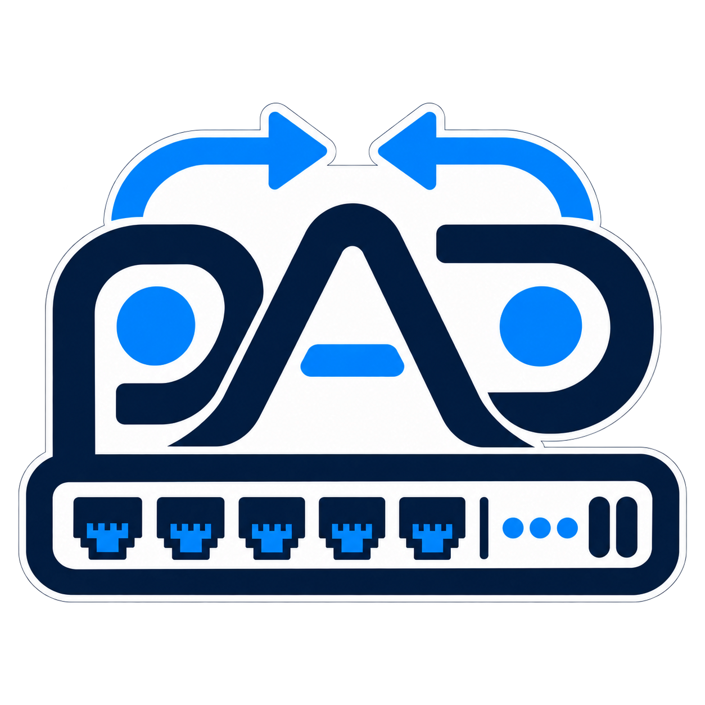
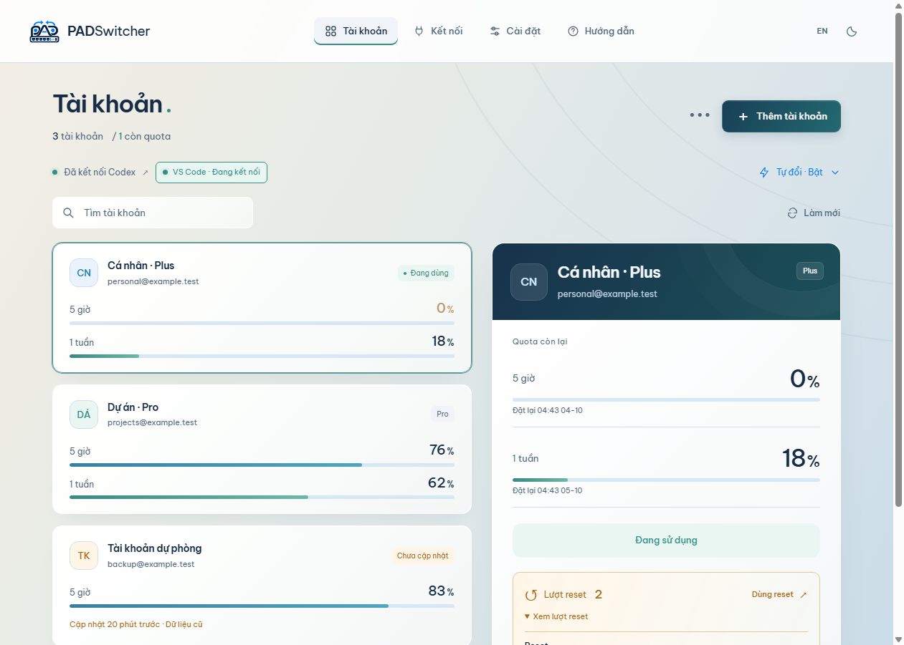
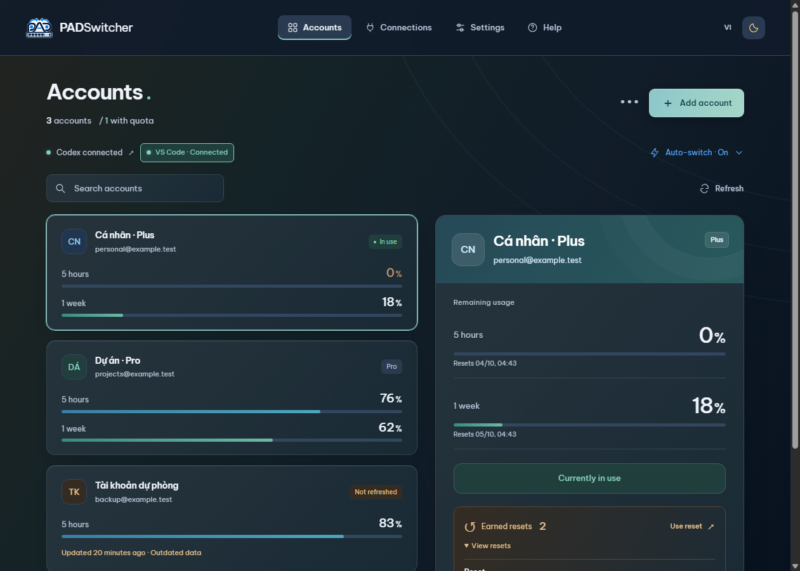

# PADSwitcher



Manage your personal Codex accounts on Windows: check remaining quota, switch accounts and keep working in VS Code, the CLI or JetBrains AI Assistant. Light/dark themes and Vietnamese/English UI.

**[Download for Windows](https://github.com/padduwcs/PADSwitcher/releases/latest)** · [Tiếng Việt](README.md) · [Report a bug](https://github.com/padduwcs/PADSwitcher/issues)

 

## First-time setup

**Requirements:** Windows 10/11 x64, .NET Framework 4.8 and a Windows Codex CLI or VS Code Codex extension. Routing has been verified with Codex **0.160.0**; older versions are unsupported. The portable app does not require Node.js.

1. Download `PADSwitcher-<version>-Windows.exe` from Releases, place it in a folder of your choice and open it.
2. Click **Add account** and sign in through your browser. Repeat for your accounts. You can also import your existing local Codex session through the app's import option.
3. Select an account → **Use this account** to start the connection.
4. Connect your Codex client as described below.

### VS Code extension

1. Open **Connections → Set up VS Code** in PADSwitcher.
2. Save your work, run **Developer: Reload Window** in VS Code once, then open the Codex extension.
3. Check the app's status: **Configured · waiting for extension** means the path is configured but the extension has not connected; **Connected** means the extension completed its connection handshake.

Automatic setup targets regular VS Code and its default User profile. Workspace settings or other profiles can override `chatgpt.cliExecutable`; check those if the extension does not connect.

### CLI in a VS Code terminal or PowerShell

Copy the CLI command from **Connections** and run it in your terminal. Default path:

```powershell
& "$env:APPDATA\PADSwitcher\data\gateway\PADCodex.exe"
```

Append `resume` to reopen a conversation. The regular `codex` command uses its own login and does not route through PADSwitcher. Only the connected CLI receives account changes from the app.

### Android Studio / JetBrains AI Assistant

1. Install **AI Assistant** and the **Codex** agent in **Agents**; open Codex once so the IDE downloads its runtime. Integration currently supports **codex-acp 2.1.1**.
2. Start the PADSwitcher connection with **Use this account**, then open **Connections → Set up JetBrains**.
3. Select **Codex · PADSwitcher** in **AI Chat** and start a new chat. Restart the IDE once if the agent is missing.
4. Check **Agent → Connected** in PADSwitcher. **Configured** confirms setup only; it does not confirm a live chat connection.

Manual/automatic account switching applies to this agent just as it does to VS Code/CLI. The regular **Codex** agent keeps its own login. Existing regular-agent chats are not transferred automatically. Setup adds an agent to `%USERPROFILE%\.jetbrains\acp.json` and preserves other agents. It uses the IDE-managed Node.js runtime; no separate Node.js installation is needed.

To return to normal operation, select the regular **Codex** agent. Optionally remove the PADSwitcher agent under **Connections → Remove JetBrains connection**. Tool permission prompts remain in the IDE.

## Daily use

### Shared or separate accounts

VS Code, JetBrains and the connected CLI share an account by default. To separate them:

1. Open **Connections → Account** on the VS Code, JetBrains or CLI card.
2. Choose **Separate account**, select an account and save. Wait for active turns to finish before changing mode.
3. Reload VS Code, reopen JetBrains chat or restart the CLI **once**. The helper path stays unchanged.
4. On **Accounts**, choose **Use for → VS Code / JetBrains / CLI**. **Use this account**, **Auto switch** and switch history apply to the selected connection. Choose **Shared** to manage the shared group.

For example, VS Code can use A → B while JetBrains uses C → D. VS Code's quota fallback to B leaves JetBrains on C. Later account switches within a mode do not require an IDE restart. If both use the same account, they consume the same quota; exhausted-account cooldowns are shared.

To rejoin the shared group, select **Connections → Account → Shared** and reopen that connection once. Its private auto-switch policy is retained. Separation is by client type: all VS Code windows share the VS Code group, and all PADSwitcher JetBrains chats share the JetBrains group. A CLI running in a VS Code terminal belongs to the **CLI** group.

Open PADSwitcher before using Codex through this connection. You can start VS Code first; reload its window once if the extension does not reconnect when PADSwitcher is ready.

- **Manual switching:** select another account → **Use this account**. The app waits for active turns to finish. If Codex already stopped due to quota, send **continue** in the same conversation. Each switch does not require another login or a VS Code restart.
- **Automatic switching:** enable **Auto switch**, choose at least two personal accounts and set their priority. A model request rejected for quota before response output is retried with a backup account using the exact same request and context. This applies both at the start and after completed steps; no extra “continue” message is sent.
- **Quota:** the two bars show the **remaining** short/long-window allowance. Refresh when needed; stale data is marked.

Version **1.13.0** removes the experimental GPT Web feature (builds 1.10–1.12) entirely; Codex code and behavior are identical to 1.9.2. Version **1.9.2** fixes lost cache-affinity metadata and premature termination of long responses. Usage refresh runs **every minute**, only reads account metadata and does not call the model; a busy operation can delay a refresh. To update an older running version, quit PADSwitcher through its tray icon, open the new build and reconnect your client. Saved accounts are retained.

To investigate usage, open **Settings → Check system → Model activity** for request, upstream-attempt, quota-retry and reported cached-input figures. Counts reset when the connection restarts; they are not quota charges. Consumption also depends on the model, reasoning effort and full context. A short follow-up in a long conversation can still be expensive, especially after switching to an account with a cold cache.
- **Resets:** counts and expiry dates appear only when supplied by Codex. `—` means unavailable, not zero. **Use reset** opens a confirmation; only confirming consumes a credit. If the outcome is uncertain, use **Check reset** instead of starting another request. A reset does not resume a stopped conversation automatically.
- **Window controls:** while the connection is running, **X** hides the window to the system tray and Codex stays connected. **–** minimizes to the taskbar. Use the tray menu to quit completely. If the connection is stopped, X closes the app.

There is currently no Windows auto-start or automatic updater.

## Scope and data

Automatic routing supports personal Free/Plus/Pro accounts. Organization accounts, WSL, SSH/containers and Codex cloud are unsupported. The app uses your local Codex installation and preserves its sandbox and tool approval flow.

Automatic switching only handles confirmed quota failures before response output. Partial responses, network/other failures and exhausted backup accounts may still stop Codex: select an account with quota and continue in the same conversation. Seamless recovery is not guaranteed for every failure or future Codex version.

Sessions are encrypted with Windows DPAPI under `%APPDATA%\PADSwitcher\data`. Do not share this directory or gateway connection files. Source and release packages contain no author accounts. See [security](SECURITY.md) and [validation scope](VALIDATION.md). **Real reset consumption has not been tested**; reset tests use fixtures.

**Updates:** quit the previous version from the tray and open the new executable. Keep your app data to preserve accounts. Reload VS Code if it does not reconnect. The portable build is currently unsigned; compare `Get-FileHash` output with the release's `.sha256` file.

## Build from source

Install **Node.js 24 LTS** and Git:

```powershell
git clone https://github.com/padduwcs/PADSwitcher.git
cd PADSwitcher
npm ci
npm start
```

`npm run dist` creates the portable executable in `dist`. The native helper builds automatically. See [DEVELOPMENT.md](docs/DEVELOPMENT.md) for checks and packaging, and [ROUTING.md](ROUTING.md) for architecture.

[MIT license](LICENSE) · [Third-party notices](THIRD_PARTY_NOTICES.md). Independent project, not an official OpenAI product.
