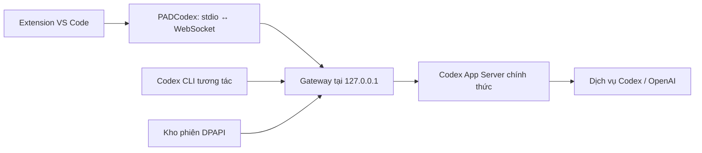

# PADSwitcher 1.5.0


Ứng dụng Windows quản lý tài khoản ChatGPT dùng với Codex: lưu phiên bằng DPAPI, xem quota còn lại và đổi tài khoản cho extension/CLI qua kết nối cục bộ.

Mã nguồn: [padduwcs/PADSwitcher](https://github.com/padduwcs/PADSwitcher). Bản portable 1.5.0 sau khi đóng gói nằm trong `dist`; tài khoản và cấu hình cá nhân không nằm trong repository.

## Giao diện và lượt reset

- Nút **EN / VI** và biểu tượng mặt trăng ở góc trên đổi ngôn ngữ và sáng/tối ngay. Có thể chọn trong **Cài đặt → Giao diện**; lựa chọn được nhớ trên máy.
- Hai thanh quota xếp trên–dưới: xanh dương cho cửa sổ ngắn, xanh ngọc cho cửa sổ dài, cam khi gần hết. Thanh vẫn hiển thị **phần còn lại**.
- Trong chi tiết tài khoản, **Lượt reset** hiển thị số lượt do Codex cung cấp. **Xem lượt reset** mở danh sách và hạn dùng nếu có. Nếu dịch vụ chỉ trả số lượt, hiển thị số đó; không suy ra số lượt từ số dòng. `—` nghĩa là chưa có dữ liệu, khác với 0 lượt.
- **Dùng reset** đọc lại số lượt và mở xác nhận cho tài khoản đó. Chỉ **Xác nhận dùng reset** mới tiêu thụ một lượt. Có thể dùng một dòng cụ thể hoặc để dịch vụ chọn lượt tiếp theo. Hủy hộp thoại không tiêu thụ lượt.
- Nếu chưa rõ kết quả do lỗi mạng, dùng **Kiểm tra reset** để kiểm tra lại cùng mã yêu cầu. Mã được lưu trước khi gửi và giữ qua khởi động lại; không tự gửi lại, tự dùng reset hoặc đổi sang mã mới khi kết quả còn chưa rõ.
- Sau reset, quota được đọc lại từ Codex. Nếu lần đọc lỗi, giao diện đánh dấu cần cập nhật; không tự giả định quota đã đầy. Reset **không tự khởi động lại lượt đã dừng**: quay lại hội thoại Codex và nhắn tiếp tục nếu cần.

Tính năng dùng API chính thức `account/rateLimits/read` và `account/rateLimitResetCredit/consume`, với `idempotencyKey` và `creditId` tùy chọn. [Tài liệu Codex App Server](https://learn.chatgpt.com/docs/app-server#8-earned-rate-limit-resets-chatgpt). PADSwitcher ưu tiên Codex từ extension đang cài để đọc quota/reset. Bản Codex cũ hoặc tài khoản chưa được dịch vụ cung cấp dữ liệu sẽ không có nút dùng reset.

**Chưa thử tiêu thụ reset trên tài khoản thật**, theo yêu cầu của người dùng. Các kiểm thử reset đều dùng backend và phiên giả; không xác nhận kết quả sử dụng reset thực tế hoặc điều kiện được cấp lượt cho tài khoản của bạn.

## Dùng ngay

Mở **`dist/PADSwitcher-1.5.0-Windows.exe`**. Thoát PADSwitcher cũ trước khi mở bản mới; kho tài khoản, cấu hình kết nối và thứ tự tự đổi hiện có được giữ nguyên. Cần Windows 10/11 x64, .NET Framework 4.8 và Codex chính thức; không cần Node.js/npm hoặc Administrator. Gateway ưu tiên binary đi kèm extension VS Code để khớp giao thức.

1. Bấm **••• → Lưu tài khoản hiện tại**, hoặc **Thêm tài khoản** qua trang OpenAI. Nếu chưa có tài khoản nào, nút lưu cũng xuất hiện giữa màn hình.
2. Chọn tài khoản → **Dùng tài khoản này**. Chờ **Đã kết nối Codex**.
3. **Extension:** mở trang **Kết nối** → **Thiết lập VS Code**, lưu công việc rồi chạy **Developer: Reload Window** trong Command Palette **một lần**. Công cụ đặt `chatgpt.cliExecutable` trong User settings và giữ giá trị trước để khôi phục. Áp dụng cho VS Code bản thường, hồ sơ mặc định trên Windows.
4. **CLI trong terminal VS Code:** mở trang **Kết nối** → **Sao chép lệnh**, dán vào **PowerShell** rồi chạy. Hoặc bấm **Mở CLI**. Có thể thêm `resume` để chọn hội thoại:
   ```powershell
   & "$env:APPDATA\PADSwitcher\data\gateway\PADCodex.exe"
   & "$env:APPDATA\PADSwitcher\data\gateway\PADCodex.exe" resume
   ```
5. Để đổi tài khoản, chọn tài khoản khác → **Dùng tài khoản này**. Công cụ chờ **tất cả** lượt đang chạy hoàn tất, rồi đổi cho lượt tiếp theo; giữ hội thoại và kết nối đang mở. Yêu cầu mới gửi trong lúc chờ bị từ chối rõ ràng; gửi lại sau khi chuyển xong.

**Mọi kết nối qua PADSwitcher cùng dùng một tài khoản đã chọn.** Lệnh `codex` thông thường, extension chưa cấu hình và ứng dụng Codex desktop vẫn dùng phiên riêng của chúng. CLI qua PADSwitcher hỗ trợ giao diện tương tác, `resume`, `fork`; không dùng cho `exec`, cloud jobs hoặc tác vụ tự động. Realtime/background sessions chưa hỗ trợ.

Nút **×** thu ứng dụng xuống khay khi gateway bật. Menu khay có **Mở PADSwitcher** và **Thoát PADSwitcher**. Thoát bình thường chờ hết lượt; **Kết nối → Dừng kết nối** có lựa chọn ngắt lượt với xác nhận cụ thể. Khi mở lại PADSwitcher, gateway tự bật với tài khoản đã chọn lần trước, trừ khi bạn đã bấm Dừng kết nối. Client bị mất kết nối cần mở lại; extension có thể cần Reload Window để kết nối lại.

Để bỏ tích hợp: **Kết nối → Gỡ kết nối VS Code → Khôi phục cấu hình VS Code trước**, rồi Reload Window. Công cụ chỉ trả lại cài đặt của nó, giữ các cài đặt khác; nếu bạn đã tự đổi đường dẫn Codex sau này, công cụ giữ nguyên thay đổi đó.

## Tự đổi tài khoản và tiếp tục khi hết quota

Mặc định **tắt** để giữ cách dùng hiện tại. Trên trang Tài khoản, bấm **Tự đổi · Tắt/Bật** → bật **Tự đổi và tiếp tục hội thoại** → chọn ít nhất hai tài khoản, đặt số ưu tiên (số nhỏ trước) → **Lưu thiết lập**. Không phải kết nối lại extension/CLI khi bật tùy chọn này. Tài khoản mới thêm sau đó chỉ tham gia khi bạn chọn nó trong thiết lập.

Khi Codex chính thức kết thúc lượt với mã `usageLimitExceeded`, PADSwitcher chờ mọi lượt khác kết thúc, kiểm tra lịch sử và trạng thái công cụ, chọn tài khoản dự phòng, rồi gửi **một lời nhắc tiếp tục trong cùng thread** qua chính kết nối client đang mở. Giữ model, môi trường, sandbox, approval policy và output schema của lượt trước; không đổi model/gói dịch vụ, không tự chấp thuận công cụ. Không phát lại nguyên input, lệnh, sửa file hoặc kết quả công cụ. Model nhận lịch sử đã lưu và được yêu cầu kiểm tra phần đã làm trước khi tiếp tục; model vẫn có thể chủ động đề nghị thao tác mới, theo quyền Codex bình thường.

Ví dụ: A đã sửa file → lần hỏi model tiếp theo báo hết quota → PADSwitcher tự chọn B → Codex kiểm tra tiến độ rồi làm tiếp. Có thể vẫn thấy thông báo quota của lượt A và lời nhắc tiếp tục do PADSwitcher gửi; không che lỗi hoặc giả lập kết quả thành công. Đây là một lượt mới trong cùng hội thoại, không nối byte đang truyền dở.

- Chỉ lỗi quota **có cấu trúc từ Codex** kích hoạt. Không chuyển vì chữ “quota” trong câu trả lời, HTTP 429 chung, lỗi mạng, lỗi quyền, giới hạn ngữ cảnh, lỗi lệnh hay người dùng ngắt lượt.
- Thứ tự theo danh sách bạn chọn. Bỏ qua hồ sơ cần đăng nhập lại, CLI riêng còn mở, quota Codex đã hết trong snapshot mới hoặc thời gian chờ quota còn hiệu lực. Snapshot cũ không được coi là bằng chứng quota đã hết. Quota không có thời gian reset rõ ràng được chờ 15 phút; mỗi tài khoản chỉ thử một lần trong chuỗi phục hồi.
- Đợi tối đa 2 phút nếu còn tác vụ khác. Hết tài khoản hoặc trạng thái công cụ chưa rõ thì báo để bạn xử lý thủ công; không tự thử vô hạn. Review, hội thoại tạm/đặt tiêu đề, background/realtime và tác vụ không thuộc client đang kết nối không được tự tiếp tục.
- Bạn nhắn mới/ngắt/khôi phục hội thoại, chọn tài khoản thủ công, đổi thiết lập, bấm **Hủy lượt chờ**, mất kết nối hoặc dừng gateway sẽ hủy lượt tiếp tục còn chờ. **Hủy lượt chờ không ngắt lượt đã gửi sang Codex**; dùng nút dừng/Esc của Codex để ngắt lượt đó.
- **Lịch sử tự đổi** hiển thị lần chờ, chuyển, tiếp tục hoặc dừng. Lịch sử này chỉ nằm trong bộ nhớ phiên ứng dụng, không chứa prompt/token/lệnh. Chỉ cấu hình và thời gian chờ quota được lưu; khởi động lại không tự phát lại công việc cũ.

## Luồng hoạt động



PADSwitcher gửi access token vào **bộ nhớ** App Server bằng `chatgptAuthTokens`, rồi chuyển tiếp giao thức Codex. Codex chính thức xử lý model, công cụ, quyền chạy lệnh và hội thoại. Khi cần, Codex chính thức làm mới phiên đúng tài khoản; PADSwitcher lưu bản mới vào DPAPI. Không tự viết lại endpoint nội bộ của ChatGPT. [Giao thức App Server của OpenAI](https://learn.chatgpt.com/docs/app-server).

**Chọn tài khoản gateway không thay `.codex/auth.json`.** Khi phiên cần làm mới, tài khoản đang đăng nhập dùng chung được cập nhật theo cách lưu chuẩn của Codex; tài khoản riêng dùng vùng tạm rồi khóa lại. Gateway dùng cấu hình/skills/plugin/hội thoại cục bộ trong thư mục Codex đã chọn.

## Quota và cách dùng cũ

Thanh hiển thị **% còn lại**, cùng chiều với Codex; chi tiết có % đã dùng và thời gian đặt lại. Quota lấy qua App Server, không đọc cache giao diện desktop. Tự cập nhật khi mở/quay lại cửa sổ (tối đa một lần/phút) và mỗi 5 phút theo lựa chọn. Dữ liệu là ảnh chụp tại lần lấy; dữ liệu cũ/lỗi được đánh dấu.

Mục mở rộng trong chi tiết hồ sơ giữ lại:

- **Tùy chọn tài khoản → Nâng cao → Đổi phiên chung:** cách cũ thay `auth.json`, cần kết thúc tác vụ, đóng Codex/ChatGPT/IDE rồi mở lại. Có bản sao mã hóa, nhật ký giao dịch và khôi phục.
- **Mở CLI riêng / Tiếp tục CLI riêng:** thư mục và hội thoại riêng từng hồ sơ, không qua gateway. Bộ giám sát độc lập khóa lại phiên sau khi CLI đóng bình thường.

## Bảo vệ và giới hạn

- Kho tài khoản: **Windows DPAPI / CurrentUser**; quyền thư mục chỉ dành cho người dùng Windows hiện tại và SYSTEM.
- Gateway/backend chỉ nghe trên **127.0.0.1**, có khóa kết nối ngẫu nhiên riêng. Kiểm tra khóa trước khi nhận JSON; từ chối browser Origin; giới hạn kết nối/frame.
- Khóa gateway là khóa cục bộ, khác token tài khoản. Token tài khoản không đưa vào renderer, clipboard, tham số dòng lệnh, tài liệu hay log PADSwitcher.
- Chặn login/logout từ client; chọn tài khoản tại PADSwitcher. Chuyển tự động chỉ khi bạn bật, chọn hồ sơ dự phòng và Codex xác nhận hết quota; không thay hạn mức hoặc phát lại nguyên yêu cầu lỗi.
- **Windows Job Object và bộ giám sát chủ sở hữu** dừng backend/tiến trình con nếu PADSwitcher hoặc bộ giám sát bị kết thúc. Mất client đang chạy: yêu cầu ngắt lượt; nếu trạng thái chưa rõ, giữ chờ và không chuyển tài khoản.
- Renderer sandbox, context isolation, CSP cấm mạng và IPC kiểm tra nguồn. Xóa hồ sơ chỉ chuyển vào trash cục bộ; có khôi phục, không xóa/thu hồi tài khoản OpenAI.

**App Server WebSocket và external ChatGPT tokens là experimental;** cài đặt `chatgpt.cliExecutable` được extension đánh dấu dành cho phát triển. Đã kiểm chứng Codex **0.160.0**, extension **26.930.31730-win32-x64**; cập nhật có thể cần kiểm tra lại. [Trạng thái giao thức theo OpenAI](https://learn.chatgpt.com/docs/app-server).

Hội thoại cục bộ đã được kiểm chứng A → B. Cloud jobs, connector, quyền tổ chức/workspace và tính năng theo gói vẫn phụ thuộc tài khoản. WSL/SSH/Dev Containers/hồ sơ VS Code khác chưa kiểm chứng. Phiên bị thu hồi/hết hạn cần đăng nhập lại. Không cam kết bảo vệ trước mọi phần mềm chạy dưới cùng người dùng Windows hoặc tài khoản luôn được dịch vụ chấp nhận. Bản portable chưa ký chứng thư, chưa có cập nhật tự động.

## Dữ liệu và phát triển

Giữ nguyên **`%APPDATA%\PADSwitcher\data`** khi cập nhật:

| Vị trí | Nội dung |
|---|---|
| accounts.json | Hồ sơ, quota, cài đặt, tài khoản gateway đã chọn, thứ tự tự đổi và thời gian chờ quota |
| profiles/&lt;uuid&gt;/session.dpapi | Phiên mã hóa |
| profiles/&lt;uuid&gt;/auth.json | Bản tạm khi làm mới/CLI riêng cần dùng |
| gateway/PADCodex.exe | Cầu nối và bộ giám sát native |
| gateway/connection.json | Địa chỉ/đường dẫn khóa, không có token tài khoản |
| gateway/*-capability | Khóa kết nối cục bộ, xóa khi dừng bình thường |
| vscode-integration.json | Giá trị cài đặt extension trước khi thiết lập |
| login/, desktop-rollback-*.dpapi, trash/ | Phục hồi đăng nhập, đổi phiên cũ và hồ sơ đã xóa |

Không đưa dữ liệu này hoặc `.codex` vào Git/thư mục chia sẻ. DPAPI không dùng để xuất kho phiên sang người dùng/máy khác. Logo đang dùng là ảnh nền trong suốt bạn cung cấp, lưu nguyên bản dưới tên `padswitcher-emblem.png`; `padswitcher.ico` có 7 kích thước cho ứng dụng, khay hệ thống và PADCodex. Hai ảnh trước được giữ lại trong nguồn dưới tên `padswitcher-logo.png`, `padswitcher-symbol.png`.

Phát triển trên Windows x64, Node.js 24+, .NET Framework 4.8:

```powershell
npm ci
npm run helper
npm run check
npm test
npm run smoke
npm run smoke:ui
node scripts/gateway-guardian-smoke.cjs
npm run build
npm run dist
# Tùy chọn: cần hai tài khoản thật; chạy vài lượt inference.
npm run smoke:gateway
npm run smoke:recovery
```

Xem **[VALIDATION.md](VALIDATION.md)** để phân biệt kiểm thử thật, mô phỏng và phần chưa kiểm chứng.

